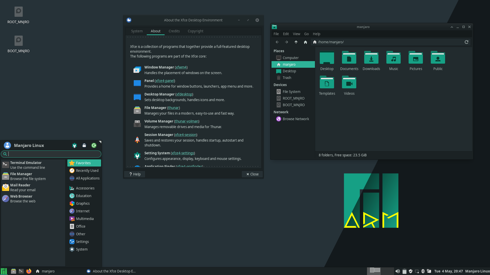

# Relatório - Distribuições Linux
##### Enviar para: celso.rcarvalho@senaisp.edu.br
Um sistema operacional é um programa ou um conjunto de programas utilizado para tornar possível a utilização de um hardware em uma máquina.
A parte mais importante do sistema operacional é o kernel, programa responsável por agir como interface central entre o hardware e o software, desde o gerenciamento de memórias e processos até chamadas do sistema e segurança.
Linux é um kernel desenvolvido por Linus Torvalds e que é utilizado mundialmente em servidores, celulares, workstations e computadores desktop, e serve como base para diversas distribuições linux (sistemas operacionais criados a partir do mesmo kernel linux).

As distribuições analisadas serão:
1. Linux Mint.
2. Linux Debian.
3. Linux Ubuntu.
4. OpenSUSE.
5. Manjaro Linux.
6. Fedora.
7. Oracle Solaris.
8. Red Hat.

Os fatores destacados serão:
- Descrição e características.
- Pontos positivos.
- Pontos negativos.
- Hardware ideal para o funcionamento.

* * *

## 1. Linux Mint

Linux Mint é uma distribuição feita para computadores desktop e laptop, ele foi criado com o propósito de funcionar "out of box", ou seja, funciona imediatamente após a instalação.
#### Descrição e características
Ela pode ser utilizada com vários ambientes de interface gráfica, porém sem dúvida a mais famosa é a Cinnamon (da foto acima), que possui design moderno, leve e elegante, muito semelhante ao Windows.
#### Pontos positivos
- Alta velocidade e desempenho.
- É possível utilizar em computadores antigos.
- Conhecido na comunidade linux.
- Impulsionado pela comunidade.
- Utiliza o gerenciador de pacotes do Debian (apt), com acesso a 30.000 pacotes.
- Seguro, estável e confiável, precisa de pouca manutenção.
#### Pontos negativos
- Não é possível atualizar o sistema, é necessário reinstalar a cada versão principal.
- Falta de suporte de grandes empresas de software no projeto.
- Não tem gerenciador de dispositivos.
- Ele é conservador, os pacotes não são atualizados na última versão, por isso, não é ideal para quem quer estar a frente das novas tecnologias.
- Sem PPA.

#### Hardware Ideal para funcionamento
- 2GB RAM.
- 20GB de Espaço em disco.
- Resolução 1024x728.

* * *

## 2. Linux Debian

#### Descrição e características
O Debian, anteriormente chamado de Debian GNU/Linux, é um sistema operacional composto inteiramente a partir de softwares e programas livres, e mantido pelo Projeto Debian.
Ele é um sistema de uso geral, sendo possível utilizá-lo tanto no laptop e desktop quanto em servidores do mundo inteiro.
A interface gráfica padrão do Debian é o GNOME (como na foto acima), porém é possível utilizar qualquer ambiente desktop ou gerenciador de janelas que você preferir.

#### Pontos positivos
- Estabilidade de sistema.
- Gerenciador de pacotes APT: É um vasto gerenciador de pacotes com mais de 30000 pacotes mantidos.
- Tem suporte a diferentes arquiteturas de sistema.
- É madura, estabelecida na comunidade e confiável.
- Disponibilidade de software livre e proprietário.
- Ótimo para servidores.

#### Pontos negativos
- Conservador: os pacotes do APT em sua maioria não estão atualizados com as últimas versões disponibilizadas pelos softwares, o que faz com que quase sempre você esteja rodando uma versão anterior a atual em sua máquina.
- Não é muito amigável para o usuário comum, pois essa distribuição foi feita para Admininstradores de sistema e desenvolvedores, novos usuários se sentirão perdidos.
- Sem versão para empresas como o CentOS, portanto possui menos suporte, livros e documentação de empresas.

#### Hardware Ideal para funcionamento
- 1GB RAM.
- 10GB de Espaço em disco.

* * *

## 3. Linux Ubuntu

#### Descrição e características
Sendo uma das maiores distribuições Linux existentes no mundo, suas principais características são a facilidade e a acessibilidade, além na vasta quantidade de pacotes disponíveis, tornando-o um sistema completo.

#### Pontos positivos
- Interface amigável para novos usuários (GNOME).
- Possui um bom suporte a aceleração de hardware.
- Atualizações simplificados pelo Software Center e apt-get.

#### Pontos negativos
- Certas placas de vídeo não funcionam perfeitamente.
- Certos hardwares (algumas impressoras) não funcionam perfeitamente.
- Softwares de edições como o Adobe Creative Suite não possuem suporte.

#### Hardware Ideal para funcionamento
- Resolução 1024x728.
- Processador com 2GHz e dual-core.
- 25GB de Espaço de disco.
- 4GB de ram (Porém com apenas 1GB ele funciona).

* * *

## 4. OpenSUSE

#### Descrição e características
O openSUSE é um sistema operacional Linux que se destaca pela leveza e, ao mesmo tempo, gama de ferramentas avançadas. O sistema operacional traz de fábrica programas avançados para edição de textos, planilhas eletrônicas e edição de imagens, além do navegador Mozilla Firefox e outros aplicativos. No geral, o conjunto é mais do que suficiente para a maioria dos usuários.

#### Pontos positivos
- Sistema regrado pela comunidade.
- Solido e estável como uma "pedra".
- Grande contribuidor para o Kernel do Linux.
- Possui uma boa instalação, setup e ferramente de administração (YaST).
- Versão Tumbleweed (Rolling Release).
- Ótimo para admininstradores de sistema.

#### Pontos negativos
- Para uso doméstico não possui uma fácil instalação.
- Documentação não amigável para o usuário comum.
- Depende muito de repositórios criados pela comunidade.
- Baixo suporte para multimedia comparado a outras distros.
- Roadmap do projeto pouco claro.
- Gerenciador de pacotes possui quantidade considerável de pacotes com problemas.

#### Hardware Ideal para funcionamento
- Processador com 2.4GHz (AMD64 ou INTEL64 recomendado).
- 40GB de Espaço de disco.
- 2GB de ram.

* * *

## 5. Manjaro

#### Descrição e características
Manjaro é uma distribuição orientada para desktop baseada em Arch Linux, ele possui um processo de instalação intuitivo e uma interface gráfica amigável para novos usuários, o Manjaro utiliza o Xfce, Gnome e KDE como principais opções de interface gráfica, e utiliza como gerenciador de pacotes padrão o PACMAN e PAMAC, sendo possível utilizar repositórios do AUR (Arch User Repository).
#### Pontos positivos
- Interface fácil e intuitiva de ser usada (GNOME).
- Boa parte dos pacotes atualizados (Por utilizar os mesmos gerenciadores de pacote que o Arch).
- Rolling Release (Atualizações continuas no sistema operacional).
- Possibilidade de instalar múltiplos-kernels de linux.

#### Pontos negativos
- Sistema desenvolvidos recentemente, cheio de bugs falhas.
- Não é estável, e pode ser facilmente quebrado, necessitando de intervenção do usuário para correção dos erros.
- Fracas práticas de manutenção.
- Algumas práticas runs de segurança.

#### Hardware Ideal para funcionamento
- Processador 2Ghz.
- 2GB RAM.
- 30GB de espaço em disco.

* * *

## 6. Fedora

#### Descrição e características
Fedora é uma distribuição desenvolvida pelo Projeto Fedora apoiado pela comunidade e que também pertence a Red Hat, O Fedora contém software distribuido em uma licença gratuita e livre que almeja se tornar lider nesse segmento da tecnologia.
O Fedora tem a reputação de focar em inovação e integração de novas tecnologias dentro do ecossistema linux.
Interface padrão do Fedora é o GNOME, mas é possível utilizar outras interfaces gráficas e gerenciadores de janelas.
#### Pontos positivos
- Interface intuitiva e fácil de usar (GNOME).
- Grande quantidade de recursos oferecidos.
- Foco em segurança do sistema.
- Gerenciador de pacotes RPM, poucos pacotes tem problemas.
#### Pontos negativos
- Softwares e Drivers proprietários são mais difíceis de usar por ser uma distro focada em programas livres e gratuitos.
- Gerenciador de pacotes RPM possui menos pacotes que o APT (Gerenciador de pacotes do Debian e derivados).
- Várias funcionalidades não funcionam imediatamente após a instalação, sendo necessária a configuração do usuário.
#### Hardware Ideal para funcionamento
- Processador 2Ghz.
- 2GB RAM.
- 20GB de espaço em disco.

* * *

## 7. CentOS

#### Descrição e características
O CentOS é uma distribuição Linux conhecida pelo seu alto nível de estabilidade, previsibilidade e pela possibilidade de ser configurada de múltiplas maneiras. Feita a partir do Red Hat Enterprise Linux (RHEL), ela é mantida em um modelo simples, com alto nível de transparência e abertura.
#### Pontos positivos
- Extremamente estável.
- Amplamente usado devido sua leveza.
- Pacotes estáveis.
- Bem documentado.
#### Pontos negativos
- É um pouco complexo porque poucas bibliotecas c/c++ darão problemas de dependências.
- Instalar/desinstalar pacotes no RHEL é uma dor de cabeça.
- Devido sua extrema estabilidade, os pacotes em sua maioria estão desatualizados.
#### Hardware Ideal para funcionamento
- Processador 1.1Ghz.
- 2GB RAM.
- 40GB de espaço em disco.

* * *

## 8. Oracle Solaris

#### Descrição e características
Solaris é um Sistema Operacional UNIX desenvolvido pela antiga Sun Microsystems, que é uma subsidiária da Oracle. As primeiras versões do Solaris (baseadas no código do BSD) foram chamadas SunOS, tendo o seu nome alterado para Solaris 2 quando passou a ser baseado no System V.

Solaris é conhecido por sua acessibilidade, especial no sistemas de SPARC, também por dar origem a muitas características inovadoras tais como DTrace e ZFS.

Solaris suporta arquiteturas baseadas nos processadores x86 e SPARC, e é um sistema que segue a especificação POSIX. Embora seja desenvolvido historicamente como um software proprietário, a maioria de seu código-fonte hoje em dia está disponível como o sistema OpenSolaris.
#### Pontos positivos
- dTrace.
- Construído em testes de conformidade.
- Gerenciamento de armazenamento via ZFS.
#### Pontos negativos
- Aprendizagem lenta.
- Não é Open Source.
- É pago.
#### Hardware Ideal para funcionamento
- CPU x86.
- 1.5GB RAM.
- 13GB de espaço em disco.

* * *

## 7. Red Hat Enterprise Linux

#### Descrição e característic
A Red Hat, Inc. é uma empresa dos Estados Unidos, que disponibiliza soluções baseadas no sistema
operativo ou sistema operacional GNU/Linux, incluindo o Red Hat Enterprise Linux, além de soluções
de software.
O RedHat® Enterprise Linux® é um sistema operacional open source e plataforma empresarial Linux
líder do mercado. Ele é a base que permite você escalar aplicações existentes e implantar novas
tecnologias em ambientes bare-metal, virtuais, em containers e em todos os tipos de nuvem.

#### Pontos positivos
- Design amigável para novos usuários.
- Alta compatibilidade com softwares.
- Infraestrutura de nuvem híbrida.
#### Pontos negativos
- Possui um histórico de muitas falhas de segurança.
- Não possui um design para controle remoto.
- Não é gratuito.
- Queda na produtividade até a adaptação ao RHET.
- Baixa compatibilidade com MS-Windows.

#### Hardware Ideal para funcionamento
- Processador 1Ghz x86.
- 1GB RAM.
- 1GB de espaço em disco.
