# Sistemas Operacionais de Código Aberto e Fechado

#### Trabalho desenvolvido por: Guilherme Hidek Abe

## Definição

Sistemas operacionais são um conjunto de softwares que tem a função de admininstrar os recursos de um sistema, desde os componentes de hardware até sistemas de arquivos.

Eles possibilitam uma interface de comunicação entre o usuário e a máquina.

No mercado existem diversos sistemas que compartilham vários aspectos em comum, no entanto, eles diferem em várias características, uma delas é a de serem código aberto ou código fechado.

Para cada sistema operacional, existe uma funcionalidade específica que server para atender um propósito. Como existem diversos tipos de computadores, existem propósitos diferentes, no entanto, se olharmos o panorama geral do mercado, vemos que o sistema operacional mais utilizado no mundo é o Android:

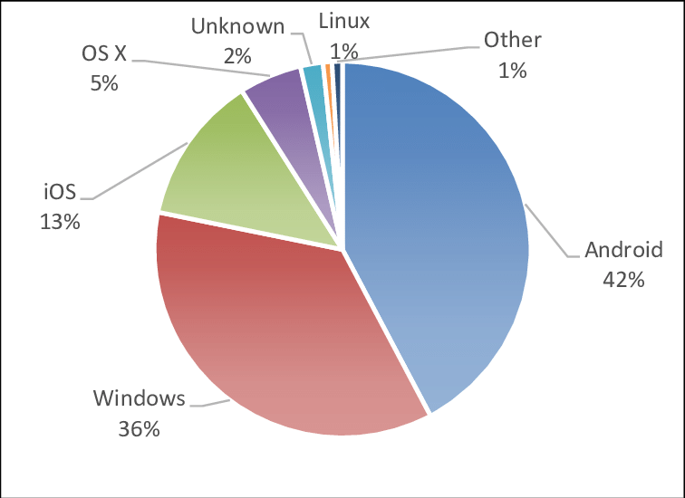

Mas no mercado de computadores domésticos, como o Notebook ou computador de mesa, vemos que o sistema operacional mais utilizado é o Windows, desenvolvido pela Microsoft, e ele é um exemplo de um **sistema operacional de código fechado**

Já o linux é considerado um **sistema de código aberto**, sendo utilizado amplamente em servidores e celulares (Android) e é considerado um dos sistemas mais utilizados do mundo.

## Windows

#### Definição

O Windows é uma família de sistemas operacionais desenvolvidas pela Microsoft e é amplamente utilizado em computadores do mundo inteiro para diversos propósitos, mas será focado nesse texto as versões para computadores pessoais.

#### Histórico

##### MS-DOS
Este foi o primeiro sistema operacional da Microsoft, é um acrônimo para Sistema Operacional de Disco da Microsoft e ele foi comprado da Seattle Computer Systems para ser usado na linha de computadores IBM-PC.

É um sistema operacional cuja interface é apenas uma linha de comando, onde o usuário digita o comando que ele deseja executar no computador

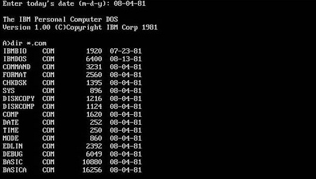

##### Windows 1.0 (1985)

Primeira versão do windows, é considerado o começo de tudo, foi lançado em 1985 e o software era uma interface gráfica que rodava sobre o MS-DOS e adicionava novas funcionalidades a ele (não era considerado um sistema operacional), o principal elemento presente era o gerenciador de arquivos e outros programas utilitários como o paint, calculadora, agenda, editor de texto (Write) e um jogo simples (Reversi).

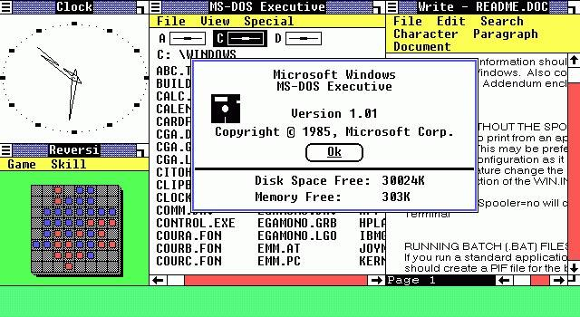

##### Windows 2.0 (1987)

Segunda versão do windows, lançado em dezembro de 1987, a grande inovação era o fato de que as janelas abertas poderiam ser sobrepostas uma a outra, e as janelas poderiam ser minimizadas ou maximizadas.

O Microsoft Excel e o Word fizeram também a primeira aparição no sistema.

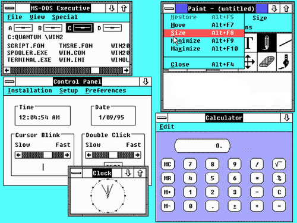

##### Windows 3.0 e 3.1 (1990)

Esta foi a primeira versão da Microsoft que fez bastante sucesso, com boas críticas do público e considerado um competidor ao Macintosh da Apple.

Ele introduziu a habilidade de rodar programas em MS-DOS tornando possível a capacidade multitarefa, implementaram inovações como o Gerenciador de programas e gerenciador de arquivos e trouxe suporte a 256 cores, dando um ar mais moderno para a interface e estabelecendo o visual padrão do windows pelos próximos 5 anos.

Foi nele que surgiu o clássico Paciência, um dos jogos mais populares do mundo, e que os PCs deram os primeiros passos rumo à multimídia, com uma extensão chamada Windows 3.0 with Multimedia Extensions que adicionava suporte a gravação e reprodução de som, dispositivos MIDI e joysticks analógicos.

O Windows 3.1 introduziu as fontes TrueType, que tornaram o sistema uma opção viável para “Desktop Publishing” (DTP, diagramação digital de livros, jornais e revistas) e outras pequenas funcionalidades

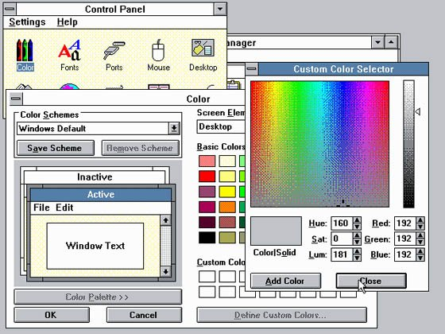

##### Windows 95 (1995)

Devido ao enorme sucesso do windows anterior, o Microsoft 95 foi lançado com diversas propagandas para ampliar ainda mais o software da empresa.

Com o propósito de tornar mais fácil a utilização dos computadores, o Windows 95 trouxe o menu iniciar e a barra de tarefas e seu navegador, o Internet Explorer.

Ele também introduziu o conceito de "plug and play", onde ao conectar um periférico, ele funcionaria imediatamente com os drivers apropriados.

Além de outras funcionalidades e mudanças no sistema, como o uso do 32 bits.

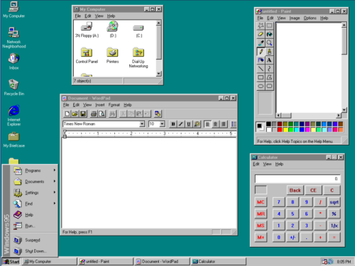

##### Windows 98 (1998)

Lançado em 1998, o Windows 98 foi construido em cima do Windows 95 e trouxe novas funcionalidades com principal foco na internet.

Foi a primeira versão do Windows com suporte nativo ao USB, drivers de DVD e ao barramento AGP.

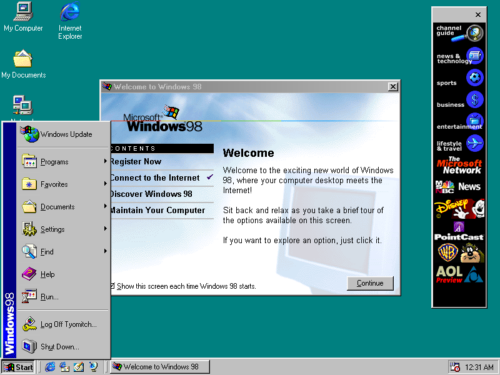

##### Windows ME (2000)

Considerado por muitos como o ponto mais baixo da Microsoft, o Windows ME foi alvo de críticas e durou apenas um ano do mercado, foi a última versão que rodava em cima do MS-DOS.

Ele não trouxe muitas melhorias em relação ao antecessor e é notório por ser "bugado".

##### Windows XP (2001)

Por muitos considerada uma das melhores versões já desenvolvidas pela Microsoft, foi lançado em Outubro de 2021 e ela trouxe uma linha para empresas e para consumidores

O Windows XP não dependia mais do MS-DOS e era baseado no Windows NT, criado para o mundo corporativo.

A interface gráfica foi renovada com novos efeitos e ganhando mais cores e o papel de parede se torno uma das imagens mais famosas.

O sistema também ganhou estabilidade e desempenho, com suporte a muita das novas tecnologias da época.

##### Windows Vista (2007)

Uma das versões mais detestadas do Windows (junto com o Me), o Vista nasceu de um projeto interno da Microsoft chamado Longhorn, que incorporaria várias tecnologias avançadas ao sistema operacional. Entretanto, um processo de desenvolvimento conturbado fez com que a Microsoft perdesse o foco, com recursos sendo adicionados de forma desorganizada e sem uma preocupação com o produto final.

Portanto, em 2004 a empresa apertou o reset, paralisou o projeto Longhorn e reiniciou o desenvolvimento, adotando uma metodologia que focava na alta qualidade de código e modularidade. Recursos do Longhorn considerados maduros o suficiente foram mantidos, enquanto outros foram adiados para futuras versões do Windows.

O principal foco do Vista foi a segurança, após vários incidentes com Worms e vírus que afetaram milhares de usuários do Windows XP ao longo dos anos.

A interface foi novamente remodelada, com mais efeitos e transparências, um estilo visual que foi chamado de “Aero”. Recursos como a busca instantânea, reconhecimento de voz, o Windows Defender (um anti-malware) e um utilitário de backup e restauração de dados foram integrados ao sistema, e o Windows Update foi simplificado.

Entretanto, todos estes recursos exigem mais hardware, e o Vista rapidamente ganhou fama de ser um sistema lento e pesado. Mudanças no sistema de drivers introduziram instabilidade no funcionamento de vários componentes do hardware, e os usuários não se acostumaram com recursos como o UAC, que exigia confirmação para realizar ações que antes eram automáticas.

##### Windows 7 (2009)

Considerado por muitos a "versão final do vista", o Windows 7 pegou todos os recursos do vista e integrou dando melhor suporte aos recursos, com o aumento da estabilidade e desempenho.

Ele foi bem recebido e também é considerado uma das melhores versões

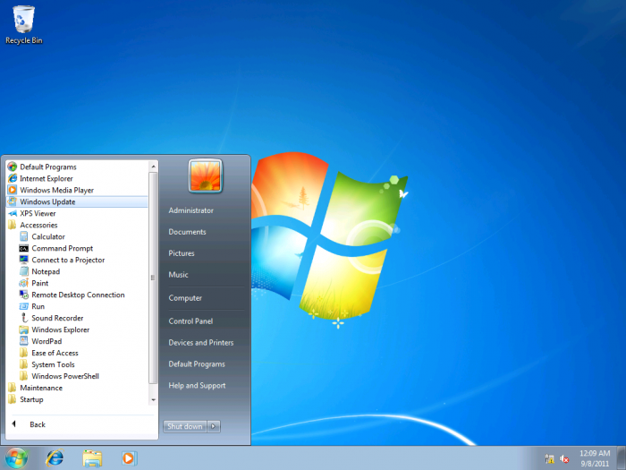

##### Windows 8 (2012)

Até o Windows 7, o padrão visual do Windows estava bem estabelecido com poucas mudanças significativas na interface, o Windows 8 surge com a ideia de quebrar esse padrão e introduzir o conceito de Tiles, blocos coloridos de vários tamanhos e divididos em categorias que constantemente trazia informações atualizadas como a música, notícias e previsão do tempo.

Essa interface melhorou muito para computadores de toque, que precisavam de botões grandes para serem tocados pelo usuários.

No entanto, grande parte dos usuários detestaram a idéia pois precisariam aprender a lidar com uma interface completamente nova.

Após pressão dos usuários a Microsoft liberou a opção de qual seria a interface padrão do sistema.

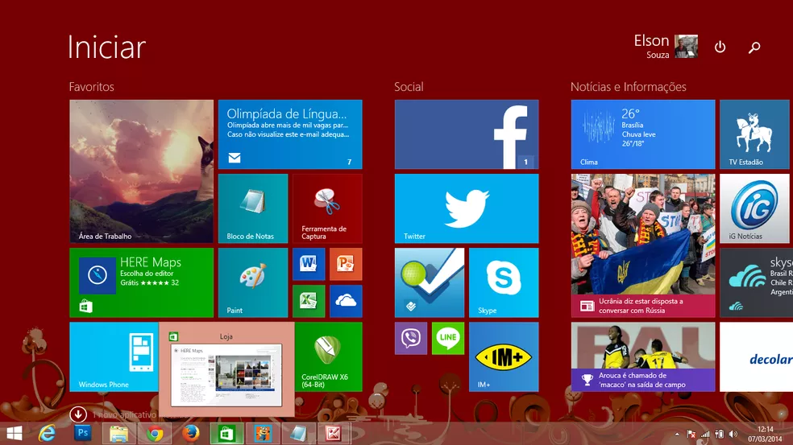

##### Windows 10 (2015)

Uma das mais bem recebidas, o Windows 10 é hoje, sem dúvidas, o sistema operacional para computadores pessoais mais estabelecido do mundo, nela, aconteceram diversas revisões na interface, para parecer mais familiar possível para novos usuários e para antigos que estavam acostumados com uma interface mais tradicional.

A Microsoft também ofereceu upgrade gratuito para qualquer usuário que já tivesse cópia legalizada do Windows 7 ou 8 no computador.

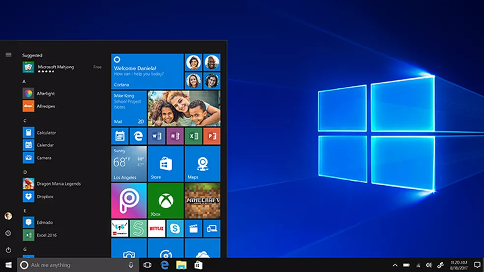

##### Windows 11 (2021)

A mais atual versão disponibilidada pela Microsoft, traz algumas mudanças no visual, arredondando bordas e apelando para uma estética mais simples e minimalistas, mais mantendo boa parte do padrão e funcionalidade de seu antecessor, entre suas novas funcionalidades estão: Melhor intregração com o WSL (Subsistema de Linux para Windows), possibilidade de rodar aplicativos android nele e melhorias na segurança e velocidade.

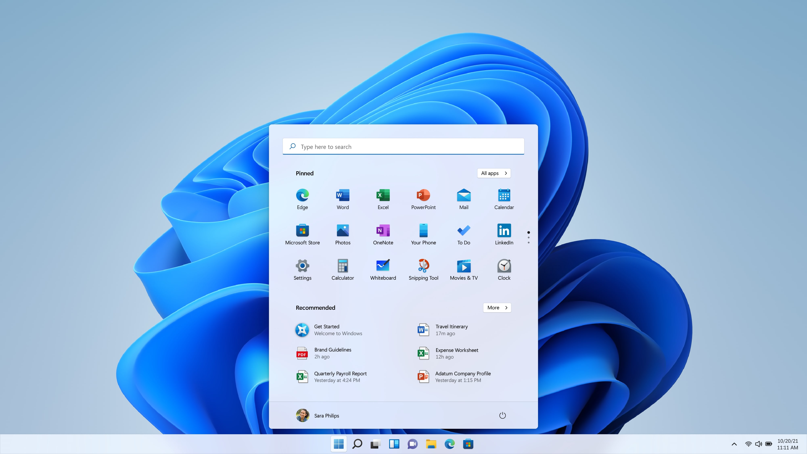

***

## Linux

#### Definição
O Linux é um termo que normalmente se refere a uma família de sistemas operacionais, no entanto, o Linux em si é um Kernel, o núcleo de um sistema operacional que possibilita a interface de comunicação entre o software e hardware.

Existem diversas sistemas operacionais que utilizam esse kernel, a qual são chamadas de distribuições Linux.

#### Histórico

A criação e sucesso do UNIX, levaram a sua adoção por várias instituições acadêmicas e empresas devido à sua disponibilidade e portabilidade.

Em 1983, Richard Stallman dá início ao projeto GNU com o objetivo de criar um sistema operacional do tipo UNIX gratuito e livre, como parte desse trabalho, ele escreveu a GNU General Public License (GPL), na década de 90, já existia grande parte do software necessário para criar esse sistema, porém o kernel (chamado de Hurd), não estava conseguindo atrair a atenção dos desenvolvedores deixando assim o GNU incompleto.

Outro projeto de sistema operacional livre chamado de BSD foi desenvolvido na Universidade da Califórnia em Berkeley, no entanto, o BSD continha código proprietário do UNIX, a qual a AT&T era a proprietária, assim a proprietária entrou com um processo contra o BSD limitando fortemente o desenvolvimento e adoção do BSD

Esses fatores supracitados junto com a criação do MINIX (Outro sistema operacional de código livre), levou a criação do linux por Linus Torvalds e a Fundação do Software Livre.

Desde então, o kernel linux, junto com os softwares desenvolvidos pelo GNU, passsaram a ser utilizados e muita das futuras distribuições que foram criadas a partir deles, sendo hoje em dia uma dos sistemas operacionais mais utilizados do mundo.

#### Distribuições

Como explicado anteriormente, distribuições linux são basicamente sistemas operacionais construídos em cima de ferramentas do projeto GNU e o kernel Linux, atualmente a mais famosa é o Ubuntu, distro baseada no Debian que é da empresa Canonical, no entanto, existem muitas outras distribuições famosas.

Entre as distribuições linux mais famosas estão:

- Mint.
- Debian.
- Ubuntu.
- openSUSE.
- Manjaro.
- Arch.
- Fedora.
- CentOS.

Para mais detalhes a respeito dessas distribuições, visite o [Relatório de distribuições Linux](https://github.com/abehidek/senai-des/blob/main/SOP/02-atividade-sistemas-operacionais/relatorio.md).

Eu pessoalmente utilizo em meu laptop a distribuição [NixOS](https://nixos.org/), uma distribuição pouco conhecida mas muito poderosa, ela utiliza um conceito bem diferente das distribuições padrões, fazendo o uso de seu próprio gerenciador de pacotes [Nix](https://github.com/NixOS/nixpkgs). Esta distribuição é reprodutível, declarativa e segura, e ela pode ser utilizada desde servidores até o uso desktop ou laptop (Como meu caso).

***

## Conclusão

Neste texto informativo abordamos apenas dois sistemas operacionais, apesar disso, existe muito conteúdo a ser comentado já que não existem apenas esses dois sistemas sendo utilizados no mundo.

Pessoalmente, entre usar Linux ou Windows, eu opto pelo Linux pela liberdade de fazer o que você quiser com seu sistema, claro que isso vem com o preço da responsabilidade, no entanto, é um preço válido a se pagar, é possível utilizar ou customizar seu sistema inteiramente caso você queira, e isso só é possível no Linux.
