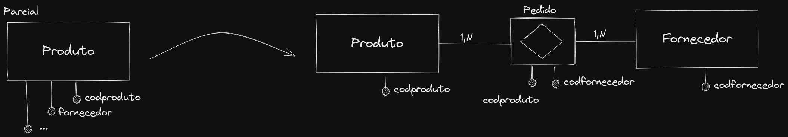

# Banco de dados

## Resumo

### Dependências

- Parcial
- Funcional
- Transitiva

### Normalização

- 1FN
- 2FN
- 3FN
- Boyce Codd

## Descrição sobre dependências

### Funcional

Situação onde tem um atributo de uma entidade dependente de apenas da chave-primária da própria entidade.

### Parcial

Situação onde um atributo de uma entidade depende tanto da chave-primária da entidade como também de algum outro atributo.

### Transitiva

Situação onde um atributo de uma entidade depende tanto de chave prímaria da própria entidade como de um outro atributo de uma possível candidata a chave-primária também.

Exemplo:

Parcial

## Normalização

### Primeira Forma Normal

Criada para retirar atributos multivalorados compostos e suas combinações. O domínio de um atributo deve incluir apenas valores atômicos (indivisiveis), e o valor de qualquer atributo em uma tupla deve ser o único valor

### Segunda Forma Normal

É necessário estar na primeira forma normal.

Não permite atributos dependentes parciais da chave primária se esta for uma chave primária composta, esta regra trata de possíveis redundâncias.

### Terceira Forma Normal

É necessário estar na segunda forma normal.

Não permite atributos que não façam sentido naquela entidade.
