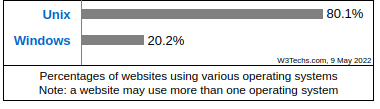

# Redes - Relatório

## Roteador

### Definição 

Roteador é um intermediário responsável por mediar a comunicação de vários computadores, eles fazem o papel de orientar e direcionar os dados da rede, utilizando pacotes que contêm vários tipos de dados como arquivos, comunicações e transmissões simples como interações na Web.

Esses pacotes de dados contem várias camadas, uma das quais contém informações de identificação, como remetente, tipo de dados, tamanho e, o mais importante, o endereço IP de destino (protocolo de Internet). O roteador lê essa camada, prioriza os dados e escolhe a melhor rota a ser usada para cada transmissão.

Dessa forma, os diversos dispositivos conectados a esta rede criam a rede LAN.

Quando um serviço de banda larga é contratado, um modem é recebido oferecendo um ponto único de acesso à internet. Desta forma, para compartilhar esta conexão com mais de um aparelho é preciso criar uma rede interna com o roteador, podendo assim estender à conexão com web para outros computadores e também para dispositivos móveis locais.

Porém, diferente de um “access point”, o roteador não é só um equipamento para a distribuição de conexões locais, realizando também o processamento das melhores rotas para transmissão de pacotes de dados, garantindo assim que seus sinais cheguem ao seu destino de maneira mais rápida possível, seguindo as melhores rotas para difundir os dados a ele encaminhados.

Os roteadores mais modernos funcionam conectados ao cabo de banda larga e possuem mais quatro saídas de cabos para computadores e uma antena, que é a parte fundamental para fazer funcionar a transmissão do sinal para a conectividade sem fio, alcançando assim dispositivos com conexão via wireless, como smartphones, tablets e notebooks.

Utilizados para melhorar a performance e a distribuição de conexões em redes de banda larga em lugares amplos e na conexão de diversos aparelhos ao mesmo tempo, os roteadores wireless estão sendo cada vez mais usados em aplicações do nosso dia a dia tais como redes locais de shoppings, lojas, aeroportos, colégios e mesmo em residências, oferecendo uma conexão com a internet de maneira rápida, segura e fácil.

## Servidor

O servidor é um computador ou sistema que fornece recursos, informação, serviços ou programas para outros computadores, que são chamados de clientes, em uma rede, na teoria, quaisquer computadores que compartilham recursos com maquinas clientes também são considerados servicores, existem diversos tipos de servidores, incluindo web servidores, servidores de mail, e servidores virtuais.

Elas estão por trás de toda aplicação que pode ser acessada na internet, desde sites, aplicativos, jogos e etc...

Um sistema individual consegue fornecer recursos e usar eles de outros sistemas ao mesmo tempo, isso significa que um dispositivo pode ser tanto um cliente quanto um servidor ao mesmo tempo.

Alguns dos primeiros servidores eram computadores mainframes, computadores capaz de processar grandes volumes de informações em curtos espaços de tempo, pois dessa forma esses servidores conseguiam fornecer dados para diversos clientes ao mesmo tempo.

Inicialmente, esses servidores eram conectados aos clientes chamados terminais, que não faziam nenhuma computação. Esses terminais, também chamados de dumb terminals, existiam simplesmente para aceitar o input via teclado ou leitor de cartão e para retornar os resultados de qualquer computação em uma tela display ou impressora. A computação de fato acontecia no servidor, no entanto, os resultados eram mostrados nesse terminal, foi nessa época que surgiram muito das soluções e tecnologias para esse ambiente, como o editor de texto VI, que foi feito pensando em minimizar o número de teclas que um ser humano escreveria para diminuir a transmissão de informações para o servidor.

Logo depois, os servidores se tornaram únicos computadores poderosos conectados em uma rede para fornecer outros computadores menos poderosos. Essa arquitetura de rede é sempre chamada como "modelo client-server", onde tanto o computador cliente quanto o servidor possui poder de computação, mas certas tarefas são delegadas para os servidores.

Hoje, a tecnologia evoluiu, e a própria definição também evoluiu junto. Atualmente, um servidor pode ser nada mais do que um software rodando em um ou mais dispositivos de computação. Esses servidores são sempre chamados como servidores virtuais. Originalmente, servidores virtuais eram Utilizados para aumentar o número de funções de servidor que um único hardware conseguia fazer. Hoje, servidores virtuais são sempre rodados por um hardware tercerizado na internet, em um arranjo chamado de computação em nuvem.

Um servidor pode ser designado para fazer uma única tarefa, como um servidor de mail, que aceita e armazena email e então fornece ele para um cliente que esteja requisitando. Servidoers também são capazes de performar diversas tarefas, alguns exemplos são:

- Servidor de arquivos
- Servidor de impressão
- Servidor de aplicação 
  - Servidor de DNS
  - Servidor de mail
- Servidor Web (Apache, nginx, APIs, IIS)
- Servidor de banco de dados (MySQL, Oracle, Cassandra, MongoDB)
- Servidor virtuais
- Servidor de proxy
- Servidor de monitoramento e gerenciamento

Vale lembrar, que o servidor é um computador, e a utilização deste só é possível com um sistema operacional, existem diversos sistemas que podem ser utilizados para isso, no entanto, o mais utilizado são sistemas Linux / Unix. No entanto, é possível utilizar toda uma categoria de sistemas desenvolvidas pela Microsoft que são os Windows servers, e eles também são utilizados no mundo. 

Exemplos de distribuições linux para servidor são:

- Ubuntu server
- Red Hat Enterprise Linux
- SUSE Linux Enterprise Server
- CentOS Linux Server
- Debian
- Arch Linux
- NixOS
- etc

*Mercado de sistemas operacionais de acordo com o [w3techs](https://w3techs.com/technologies/overview/operating_system).*

Outro sistema que não existe mais é o NetWare, que foi um dos maiores participantes desse mercado de servidores, durante a época quando os client-servers estavam se popularizando.

Há também os servidores em nuvem, que são servidores hospedados em uma infraestrutura tercerizada em uma rede aberta como a internet, existem diversos provedores de servidores incluindo o Google Cloud, Microsoft Azure, IBM Cloud e o mais famoso, Amazon AWS.
